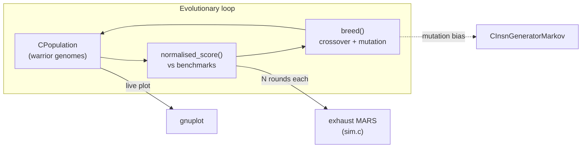

# Species-Blossom

[](https://github.com/bescritt/species-blossom/actions/workflows/build.yml)

**An evolutionary Corewars (MARS) simulator.** Species-Blossom breeds
populations of Redcode "warriors" and lets them fight a fixed benchmark set; the
fitter warriors survive and mate, generation after generation, in a genetic
algorithm that runs inside a pmars-like memory-array simulator.

It is a fork/derivative of earlier Corewars evolver work by **`Varfar`**
(2003–2006), with a bundled copy of M. Joonas Pihlaja's public-domain *exhaust*
1.9.2 Redcode simulator.

---

## What it does

1. Assembles a set of benchmark warriors (fixed opponents) into the MARS core.
2. Seeds a population of evolved warriors and scores each one by fighting it
   against every benchmark over `N` rounds.
3. Selects the fittest third of the population and **breeds** them — crossover
   plus mutation, with mutation positions biased by a Markov model of
   instruction placement (`test/koen.markov2`).
4. Repeats forever (or until you stop it), optionally plotting the live fitness
   surface with `gnuplot`.



## Features

- **Genetic evolver** for Redcode warriors — selection, crossover, mutation.
- **pmars-compatible simulator** (`exhaust-1.9.2/`): assembler, core fight loop,
  p-space (private strategy memory).
- **Markov-guided mutation** — mutation landing sites follow a learned
  instruction-position distribution.
- **Live fitness plotting** via a `gnuplot` pipe (disable with `NO_PLOT=1`).
- **Zero heavy dependencies** — just `gcc`, `g++`, `make`, and (optionally)
  `gnuplot`.

## Build

```sh
make                 # builds ./blossom
make clean && make   # clean rebuild
```

No `configure` step, no external libraries. (The `wx-config` lines that once
lived in the `Makefile` were dead — wxWidgets is not used.)

## Run

The evolver runs an **open-ended loop**; stop it with `Ctrl-C` (or bound it with
`timeout`).

```sh
./blossom                       # evolve (opens a gnuplot window for live plots)
NO_PLOT=1 ./blossom             # headless — skip gnuplot entirely
timeout 30 ./blossom            # run for 30s then stop (useful for smoke tests)
./blossom --rounds 20 --cycles 40000   # fewer rounds/cycles = faster, noisier
./blossom --help                # usage
```

> **Note:** the plotter pipe to `gnuplot` is opened eagerly in `main()`, so even
> with `NO_PLOT=1` a `gnuplot` binary must be on `PATH` at startup. The
> `NO_PLOT` flag only suppresses the actual plotting commands.

## Project layout

| Path | Purpose |
|------|---------|
| `blossom.cpp` | Entry point: sets up world, benchmarks, population, runs the loop. |
| `world.*` `benchmark.*` `population.*` `warrior.*` `reproduction.*` `battle.*` | The evolver. |
| `insn_markov.*` | Markov mutation-position model. |
| `mersenne.cpp` `rand.*` `randomc.h` | Random number generation. |
| `ui_gnuplot.*` | `gnuplot` plotting pipe. |
| `exhaust-1.9.2/` | Bundled Redcode simulator / assembler / p-space. |
| `test/` | Markov model + operand data used by the evolver. |
| `warriors/` | Helper script for converting `.red` → `.rc` load files. |
| `plot/` | gnuplot helper scripts and sample output. |
| `doc/` | [Architecture](doc/ARCHITECTURE.md) and [provenance/licensing](doc/PROVENANCE.md). |

## Documentation

- **Architecture** — component map and data flow: [`doc/ARCHITECTURE.md`](doc/ARCHITECTURE.md)
- **Provenance & licensing** — per-component license breakdown: [`doc/PROVENANCE.md`](doc/PROVENANCE.md)

## License

This is a mixed-license historical codebase. In short:

- The evolver sources (`Varfar`, 2003–2006) carry **GPL v1.0-or-later** headers.
- The root [`LICENSE`](LICENSE) is **LGPL 2.1**.
- `exhaust-1.9.2/` is **mostly public domain** (M. Joonas Pihlaja, 2002);
  `exhaust.c` is **GPL v2** (contains pMARS 0.9.2 code).
- `mersenne.cpp` is the public-domain **Mersenne Twister** reference.

The canonical rule is *"each file is governed by the license stated in its own
header; where none is stated, the root `LICENSE` (LGPL-2.1) applies."* See
[`doc/PROVENANCE.md`](doc/PROVENANCE.md) for the full breakdown.

## Links

- Corewars — <https://corewars.org>
- *exhaust* — public-domain pmars-like simulator by M. Joonas Pihlaja
