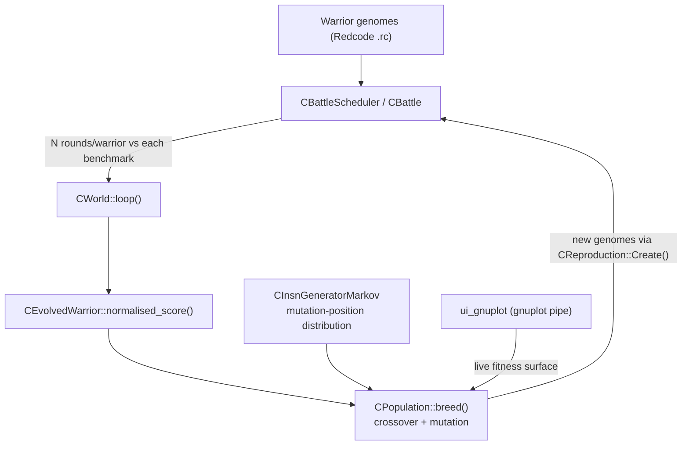

# Architecture

Species-Blossom is an **evolutionary Corewars simulator**: it breeds populations
of Redcode "warriors" whose fitness is measured by how well they fight a fixed
set of benchmark warriors inside a MARS (Memory Array Redcode Simulator).

## Evolution loop

The loop is open-ended: after every generation the population is re-bred and
re-scored. Stop it with `Ctrl-C` (or bound a run externally with `timeout`).

## Component map

| Component | File(s) | Responsibility |
|-----------|---------|----------------|
| `CWorld` | `world.cpp/.hpp` | Global config (coresize, cycles, rounds), owns benchmarks, populations, the battle scheduler and the optional plotter. Drives `loop()`. |
| `CBenchmark` | `benchmark.cpp/.hpp` | A fixed set of opponent warriors a population is scored against. |
| `CPopulation` | `population.cpp/.hpp` | A generation of `CEvolvedWarrior`s; `breed()` selects & mates the top third. |
| `CEvolvedWarrior` | `warrior.cpp/.hpp` | One genome + its cached fitness scores. `to_red()` serialises it back to Redcode. |
| `CReproduction` | `reproduction.cpp/.hpp` | `Create()` produces a child genome from two parents (crossover + mutation). |
| `CBattleScheduler` / `CBattle` | `battle.cpp/.hpp` | Schedules and runs the actual MARS combats. |
| `CInsnGeneratorMarkov` | `insn_markov.cpp/.hpp` | Markov model of instruction positions (loaded from `test/koen.markov2`) biasing where mutations land. |
| Mersenne / RNG | `mersenne.cpp`, `rand.cpp/.hpp`, `randomc.h` | Pseudo-random number generation. |
| `exhaust-1.9.2/` | `exhaust.c/.h`, `sim.c/.h`, `asm.c/.h`, `pspace.c/.h` | The underlying Redcode simulator, assembler and p-space (forked from M. Joonas Pihlaja's *exhaust*). |
| `ui_gnuplot` | `ui_gnuplot.c/.h` | Thin pipe to `gnuplot` for live score plots. Skippable via `NO_PLOT=1`. |

## Simulation core (exhaust)

The `exhaust-1.9.2/` submodule is a standalone pmars-like simulator:

- `asm.c` — assembles `.rc`/`.red` Redcode load files into internal instruction words.
- `sim.c` — the core fight loop (single and multi-warrior via `sim_mw`).
- `pspace.c` — p-space (private/strategy memory) implementation.

It is mostly public domain; `exhaust.c` carries GPL'd code from pMARS 0.9.2
(see `doc/PROVENANCE.md`).
